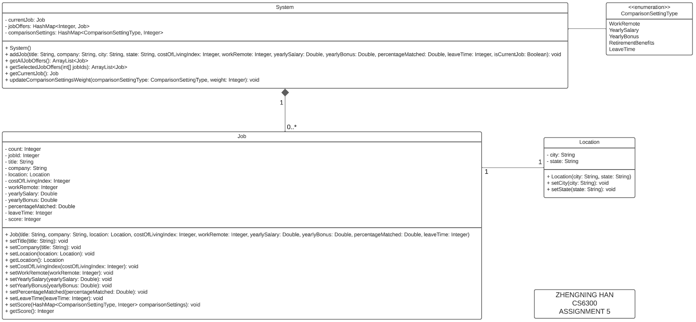
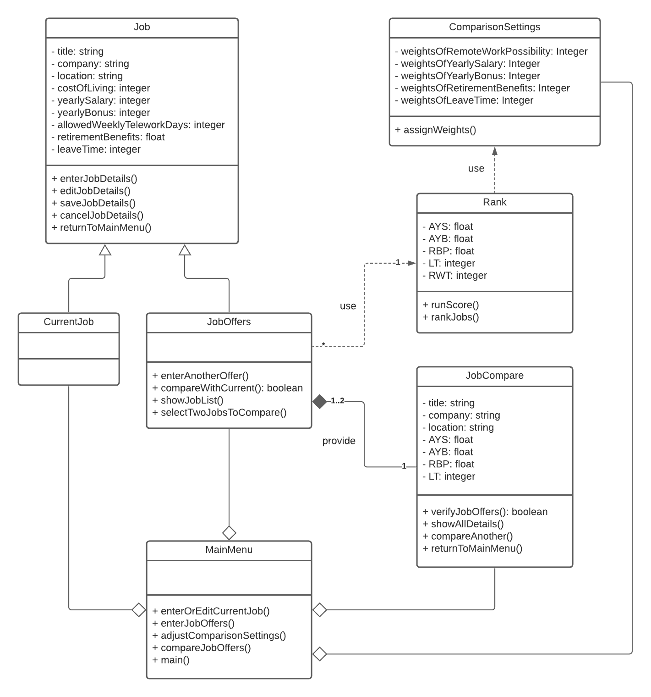
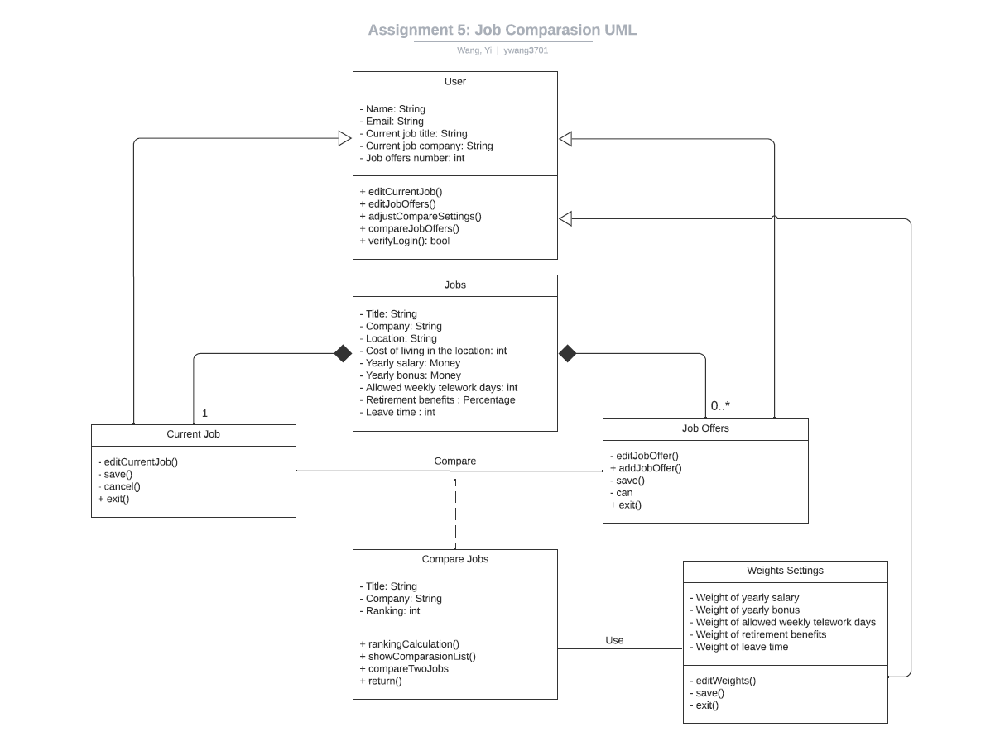
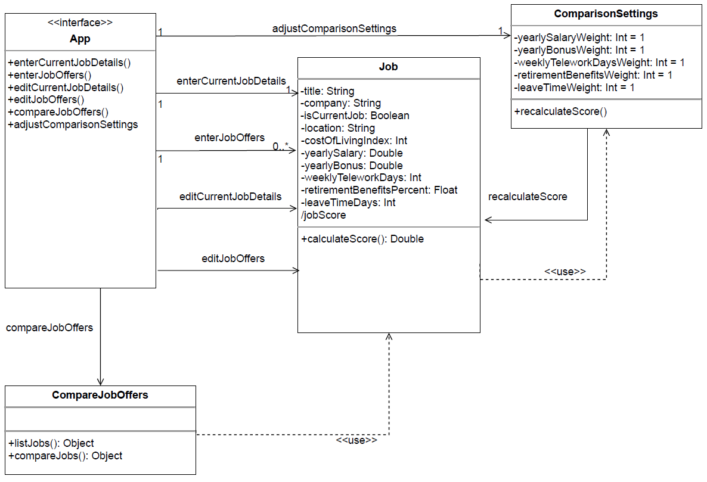

CS 6300 
Team 109 Deliberable 1

# Design 1
by Zhengning Han

### Pros
1. Low number of classes so pretty lightweight and easy to implement.
1. Includes details and allows users to easily update an attribute within a Job instance using the corresponding set method.

### Cons
1. Not necessary to have a separate Location class because there's no real value add. Same city and state in current design will result in 2 separate instances.
1. Job class operation setScore uses comparisonSettings so should have link to ComparisonSettingType.

# Design 2
by Teng Xue

### Pros
1. Shows clear relationship between the classes.
1. If need to modify Job class in the future, both CurrentJob and JobOffers will get the change since they are child classes of Job.

### Cons
1. JobCompare should connect to CurrentJob because user can compare current job with job offers
1. Can decouple frontend and backend classes e.g MainMenu is UI class whereas JobCompare is a backend class so would be nice if JobCompare does not returnToMainMenu

# Design 3
by Yi Wang

### Pros
1. Going above and beyond the requirement and thinking about how the user might need to login and creating a User class to handle that.

### Cons
1. Current Job and Job Offers should have the attribute in Jobs if the relationship is one of composition.
1. UI movements e.g. save, exit operations in Job Offers, that should be decoupled.

# Design 4
by Edmond Truong

### Pros
1. Clear logic and flow of things with methods included on the relationship lines.
1. Performance advantage to calculate score when ComparisonSettings is updated rather than waiting for score to be calculated only when the user chooses to compare job offers.

### Cons
1. Instead of using directed association relationship between App and the other classes, can represent using aggregation relationship.

# Team Design
### Commonalities

### Differences

# Summary