# Design Document

**Author**: Team 109

## 1 Design Considerations

### 1.1 Assumptions

1. There will only be 1 user.
1. There is a single system running the application so no communication or saving between devices is necessary.
1. The user will interact with the application in a reasonable fashion. For example, the user will add a reasonable number of job offers, the user will enter reasonable job details such as valid city and state, retirement benefit matching and leave time.
1. The user has all the details associated with a job and cannot enter partial information.
1. The user does not have special needs or requirements e.g. ADA.
1. Data will persist between runs unless the user deletes the application.

### 1.2 Constraints

1. The application must be lightweight in performance so it can run on an Android phone.
1. There is no external data storage and all data will be saved locally.
1. The user will not have access to the database so no deletion is possible.

### 1.3 System Environment

1. The application will be deployed to an Android phone that has a compatible API level.
1. The minimum SDK for the app is API 28: Android 9.0 (Pie).
1. The data will be stored on Android SQLite database.
1. The application will be written in Java.
1. The application must be run on a device equivalent to the Pixel_3a_API_30_x86 emulator.
1. The application will use Room 2.2.6.


## 2 Architectural Design

### 2.1 Component Diagram v2


v1 to v2: Updated component diagram to match our final implementation

We will have multiple UI components which handles the user's interaction with our application. These represent our application's frontend and control what the user will see. We have a base activity that uses the Activity API provided by Android and provides some common interface such as initializeUI for our other activity classes. The ```Enter or Edit Current Job Details``` and ```Enter Job Offers``` UI share a common ```Enter Job Details Base``` interface for common actions such as getting the input. This is convenient as job details entered by the user are common to both and will reduce duplicate code.
\
The ```System``` component houses the business logic our application depends on. It is the point of entry to our application's backend. This means upon receiving information from either the UI or Persistence layer, the ```System``` component will be responsible for processing the data and figuring out what to do next and where the data should go. This is done by delegating the right tasks to the ```Job``` and ```Comparison Settings ``` components. For example, setting default weights of 1 on system initialize will be delegated to the ```Comparison Settings``` component, while calculating job score and returning a ranked list of job details will require delegating parts to the ```Job``` component and parts to the ```Comparison Settings``` component. 
\
We are using the Room library which provides an API for interactions with Android's SQLite database. We layered our own ```App Database``` interface on top of this API to house a single entry point for creating the database, getting database connections, and creating & interacting with different tables & data elements. This app database infrastructure will provide the persistence layer that our ```System``` component uses. 

### 2.2 Deployment Diagram v2
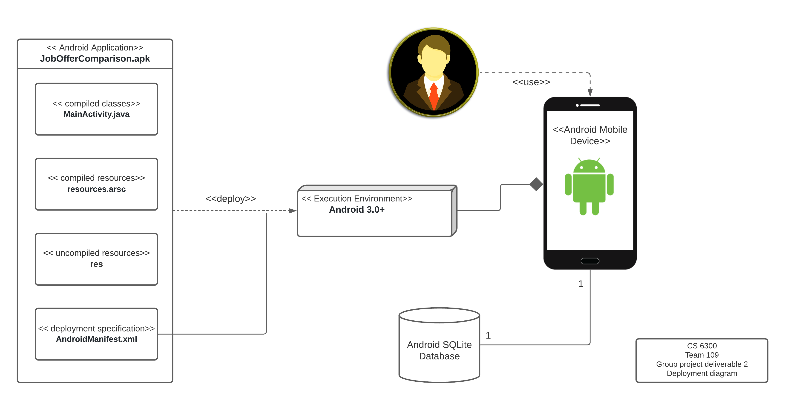

v1 to v2: Updated Room version

Our app is written in Java. It uses Android SDK tools to compile classes, resources, and code along with any required data. Android depends on Linux OS for essential operating services such as security management, process management, network stack etc. The Linux kernel plays the role of an abstraction layer between the hardware and the software stack.
\
When the app is activated by the user, it is firstly initialized by creating a new project in an Android Studio 3.0+ environment and a JobCompare6300.apk file. A collection of java classes is where the app is built and prompted to run with the help of an emulator. For the frontend of the application, an AndroidManifest.xml file is created to outline the layout of the application’s user interface (UI) and describes the main characteristics of the project to express each of its modules. For the backend of the application, all the results that are requested by the user will be firstly retrieved from the Android SQLite datebase using Room (2.2.6 version), then finally displayed on the Android mobile device to the user.

## 3 Low-Level Design

### 3.1 Class Diagram v2

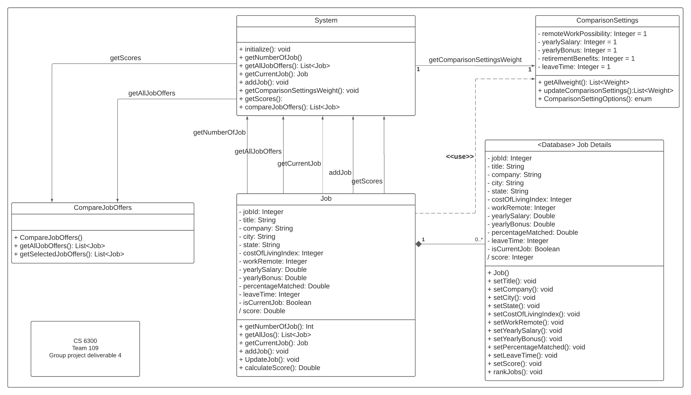

v1 to v2: Updated classes to match our final implementation

Our class diagram represents our backend classes and does not include Android Activity classes and persistence classes. 
\
The ```System``` class is the entry point and creates the ```ComparisonSettings``` and ```Job``` classes. These classes calls into our ```AppDatabase``` class which is the interface for persistence tasks. The ```JOB_DETAILS``` and ```COMPARISON_SETTINGS_WEIGHT``` classes model our database tables.
\
When entering or editing current job details, the ```System``` class will take the inputs passed from the frontend Activity class to the ```Job``` class. The ```Job``` class will create an in-memory representation of the ```Job``` using the ```JOB_DETAILS``` class and use the ```AppDatabase``` class to insert or update the database table. To get information such as current job, number of jobs, the ```Job``` class has the corresponding operations to perform these actions. 
\
A similar flow to the above is used when the user enters job offers. One difference is the flow after the user has entered the job offer. The ```System``` class will call into the getCurrentJob() operation in the ```Job``` class to determine if a current job exists so the compare with current job button can be disabled accordingly.
\
When the user adjusts the comparison settings, the ```System``` class will take the new weights the user passed from the frontend Activity class to the ```ComparisonSettings``` class. The ```ComparisonSettings``` class will update the weights in the database using the ```COMPARISON_SETTINGS_WEIGHT``` and ```AppDatabase``` classes. The ```ComparisonSettings``` class also offers operations such as setting the default weight on system initialize and returning all weights to be pre-populated on the frontend.
\
For ranking job offers, this is done by a database query called from the getAllJobs() operation in the ```Job``` class. This operation returns a ranked list of ```JOB_DETAILS``` in descending job score order and is not shown our class diagram. The number of job offers is checked using the getNumberOfJobs() operation in the ```Job``` class, called from the ```System``` getNumberOfJobs() operation, and is used to determine if the compare button should be disabled.
\
For comparing job offers, this is done purely via the frontend and not shown in our class diagram. This is possible because when the user is shown a list of job offers, we already issued a call to getAllJobs() operation and would have the information associated with a JOB_DETAILS.

## 4 User Interface Design v3
v1 to v2: Updated most designs based on implentation, included more screens for error handling and successful submission
\
v2 to v3: Updated Updated screens with updated toast message for successful submission

<section mockups>
    <table class="gui">
        <tr>
            <th>
                Requirements
            </th>
            <th>
                Mockups
            </th>
        </tr>
        <tr>
            <td class="description_width" width=350px>
                When the app is started, the user is presented with the main menu, which allows the user to (1) enter or edit current job details, (2) enter job offers, (3) adjust the comparison settings, or (4) compare job offers (disabled if no job offers were entered yet)
            </td>
            <td class="image_width">
                <figure>
                    
                    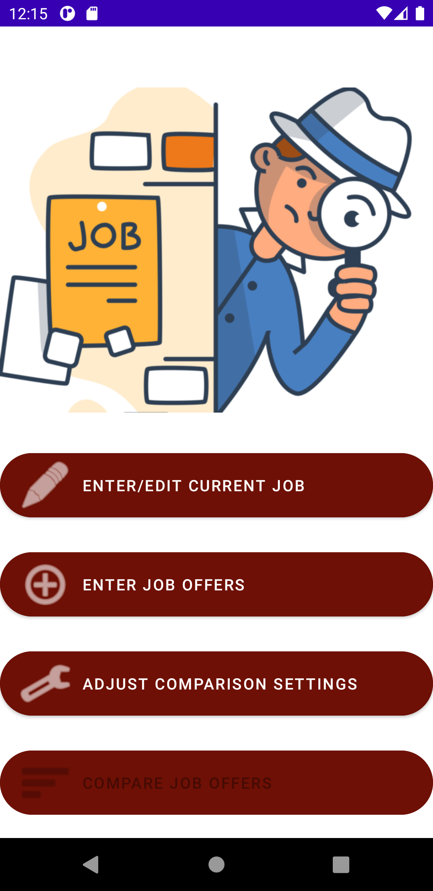
                </figure>
            </td>
        </tr>
        <tr>
            <td class="description_width" width=350px>
                When the user clicks on the ENTER/EDIT CURRENT JOB button, the user will be presented the Enter current job form.
            </td>
            <td class="image_width">
                <figure>
                    
                    
                </figure>
            </td>
        </tr>
            <tr>
            <td class="description_width" width=350px>
                If the user has previously entered a current job and is now editing it, the job details previously entered will be pre-populated.
            </td>
            <td class="image_width">
                <figure>
                    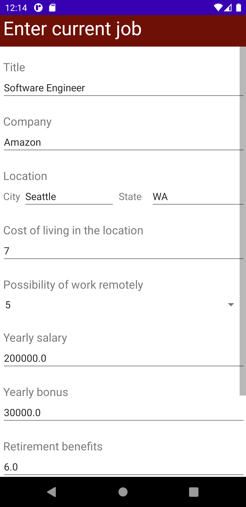
                    
                </figure>
            </td>
        </tr>
        </tr>
            <tr>
            <td class="description_width" width=350px>
                When the user clicks on the ENTER JOB OFFERS button, the user will be presented the Enter job details form.
            </td>
            <td class="image_width">
                <figure>
                    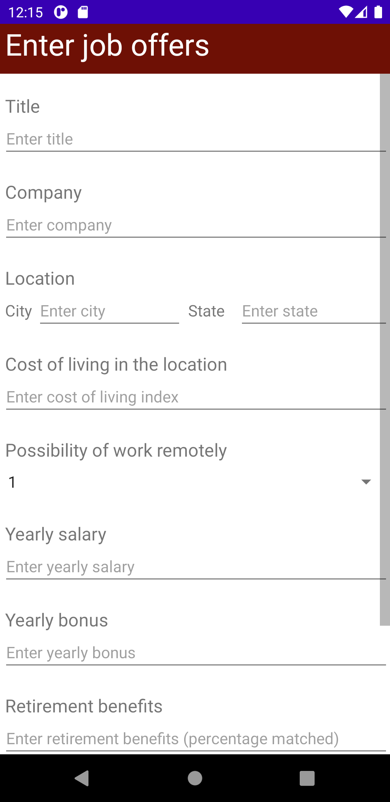
                    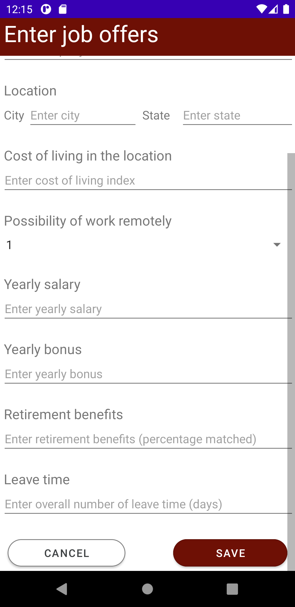
                </figure>
            </td>
        </tr>
        </tr>
            <tr>
            <td class="description_width" width=350px>
                After the user enters the job offer details and clicks on the SAVE button, the user will be presented with the options to either ENTER ANOTHER OFFER, RETURN TO MAIN MENU or COMPARE WITH CURRENT JOB (if present). If the user clicks on the CANCEL button, the user will be taken back to the main menu.
            </td>
            <td class="image_width">
                <figure>
                    
                    
                </figure>
            </td>
        </tr>
        </tr>
            <tr>
            <td class="description_width" width=350px>
                When the user clicks on the ADJUST COMPARISON SETTINGS button, the user will be presented the Adjust comparison settings screen with the current weight pre-populated.
            </td>
            <td class="image_width">
                <figure>
                    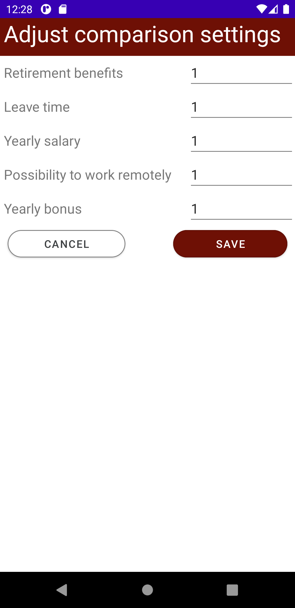
                </figure>
            </td>
        </tr>
        </tr>
            <tr>
            <td class="description_width" width=350px>
                When the user clicks on the COMPARE JOB OFFERS button, the user will be presented the Ranked list of jobs screen with the current job indicated and a list of jobs offers. The list is sorted in descending job score. The user can select two jobs to compare, selected jobs will have a checkmark next to it. The COMPARE button will only be clickable if the user has selected 2 jobs. The user will not be allowed to select more than 2 jobs.
            </td>
            <td class="image_width">
                <figure>
                    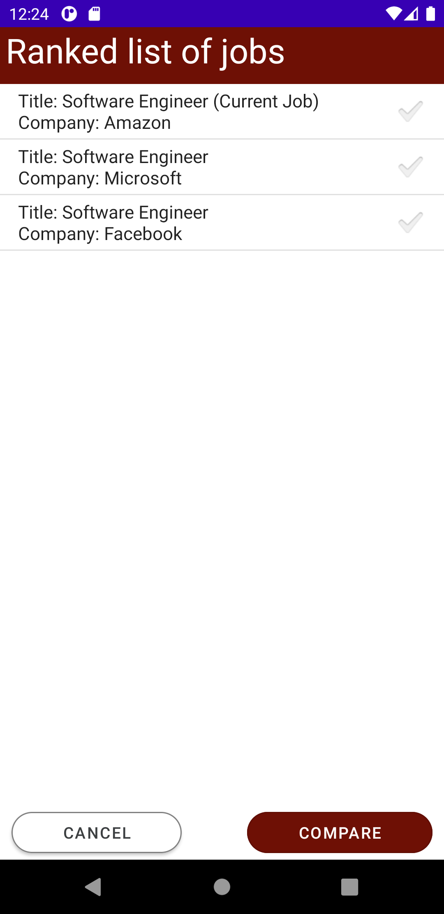
                    
                </figure>
            </td>
        </tr>
        </tr>
            <tr>
            <td class="description_width" width=350px>
                After the user has selected 2 jobs and clicks on the COMPARE button, the user will be presented with this Compare jobs screen. The table will display the job details for the selected jobs. The user will  have the option to MAKE ANOTHER COMPARISON or RETURN TO MAIN MENU.
            </td>
            <td class="image_width">
                <figure>
                    
                    
                </figure>
            </td>
        </tr>
        </tr>
            <tr>
            <td class="description_width" width=350px>
                User is required to provide all input fields correctly. An accompanying error mark will appear on the right hand side of the text field if it is invalid.
            </td>
            <td class="image_width">
                <figure>
                    
                    
                    
                    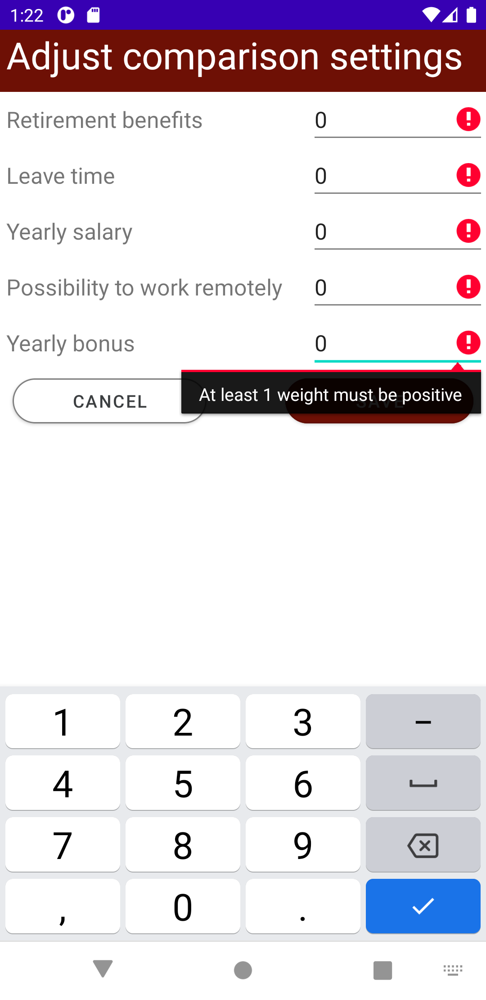
                </figure>
            </td>
        </tr>
        </tr>
            <tr>
            <td class="description_width" width=350px>
                After the user enters or edits current job or updates comparison settings weight and clicks SAVE, we automatically navigate the user back to the main menu along with a brief message to notify the user the information has been successfully saved.
            </td>
            <td class="image_width">
                <figure>
                    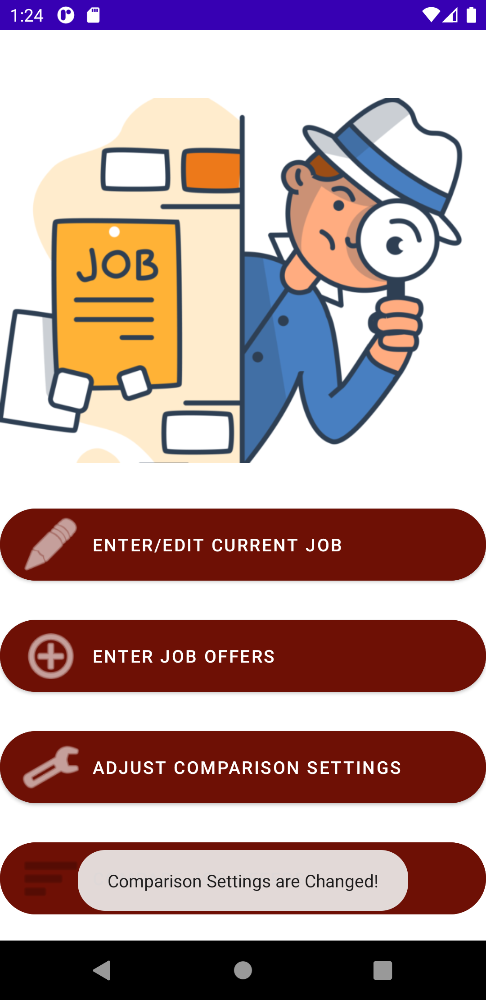
                    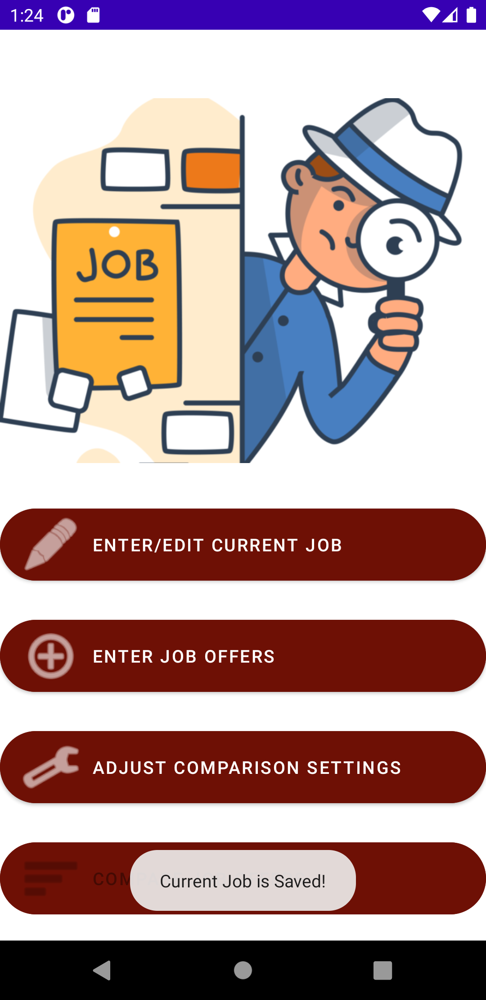
                </figure>
            </td>
        </tr>
    </table>
</section>
