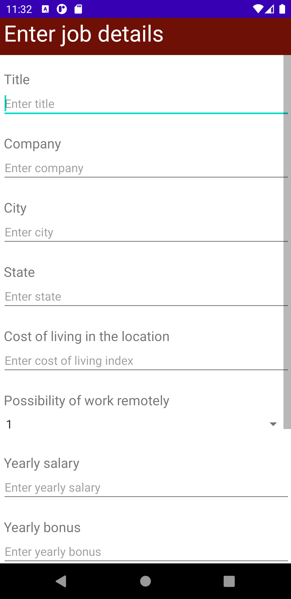
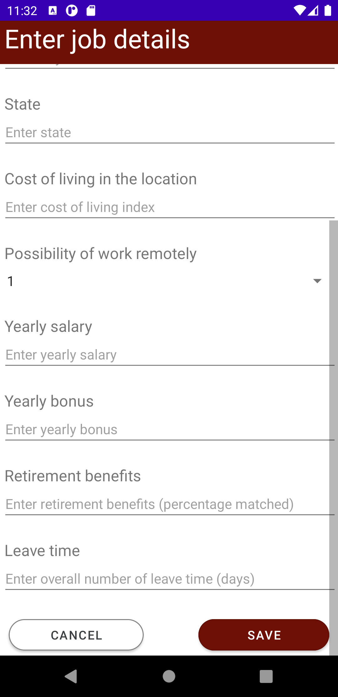
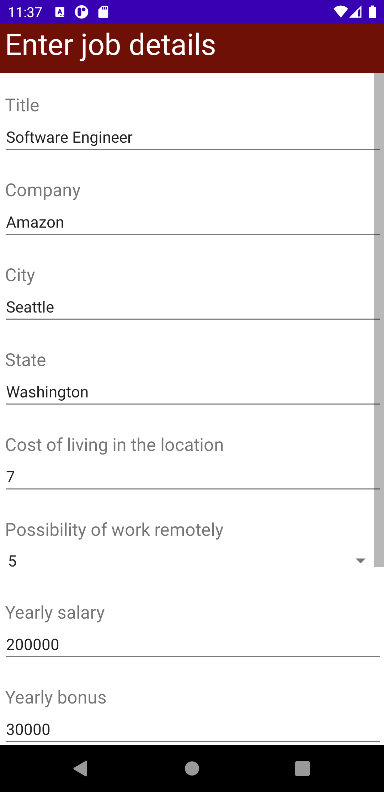
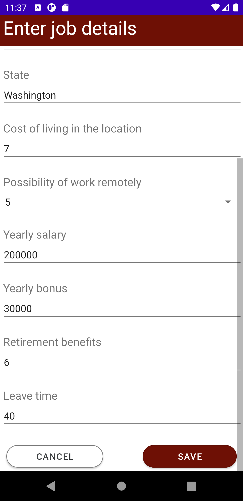
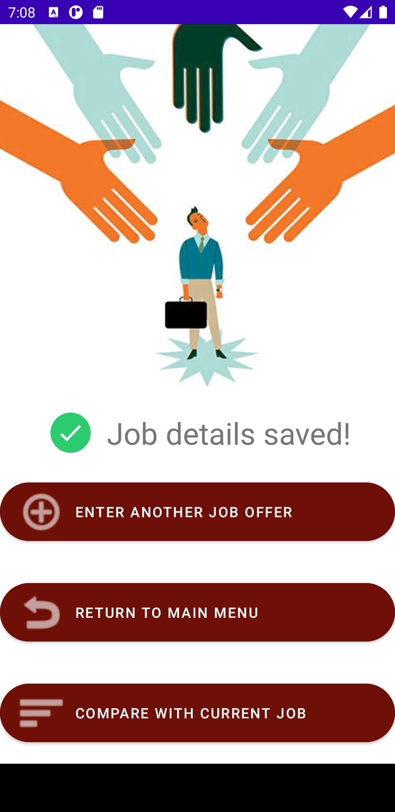
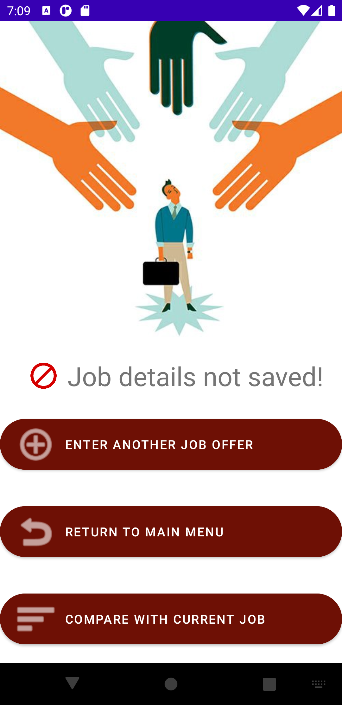
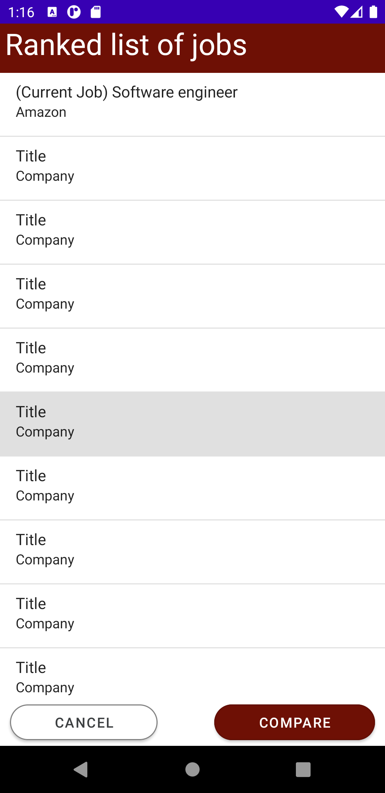
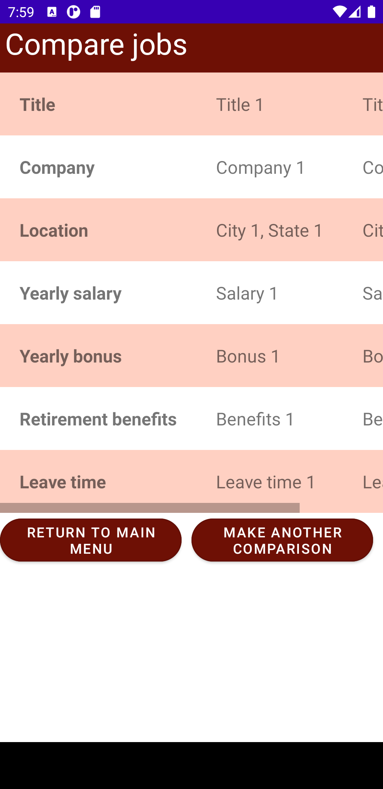

# Design Document

*This is the template for your design document. The parts in italics are concise explanations of what should go in the corresponding sections and should not appear in the final document.*

**Author**: Team 109

## 1 Design Considerations

*The subsections below describe the issues that need to be addressed or resolved prior to or while completing the design, as well as issues that may influence the design process.*

### 1.1 Assumptions

*Describe any assumption, background, or dependencies of the software, its use, the operational environment, or significant project issues.*

### 1.2 Constraints

*Describe any constraints on the system that have a significant impact on the design of the system.*

### 1.3 System Environment

*Describe the hardware and software that the system must operate in and interact with.*

## 2 Architectural Design

*The architecture provides the high-level design view of a system and provides a basis for more detailed design work. These subsections describe the top-level components of the system you are building and their relationships.*

### 2.1 Component Diagram

We will have multiple UI components for controlling the user's interactions with the application. These components will use the Activity API provided by Android.
\
The Persistence infrastructure component will provide the Persistence interface that allows our application to read and write from and to the database. The database will be the Android SQLite database.
\
Since both current job and job offers share the same attributes, the "Enter or Edit Current Job Details" component and the "Enter Job Offers" component will both inherit from a base "Enter Job" component. These components collectively will provide the JobDetails interface which is the required by the Jobs component to persist to the database.
\
When the user chooses to compare jobs, the "Display Ranked List of Jobs" UI component will require the RankedList, which the Rank Jobs component provides. The Rank Jobs component requires Jobs and ComparisonSettings in order to calculate the score for each job. These are provided by the Jobs component and "Comparison Settings" component respectively and they will read these information from the database.
\
The "Display Ranked List of Jobs" component will provide the JobOffersToCompare interface to the "Compare Jobs" component based on what the user has selected. The "Compare Jobs" component then requires the Jobs interface provided by the Jobs component to get the details of the selected jobs and provide these information via the SelectedJobs interface. The "Display Selected Jobs for Comparison" component then displays the SelectedJobs to the user. 

### 2.2 Deployment Diagram

*This section should describe how the different components will be deployed on actual hardware devices. Similar to the previous subsection, this diagram may be unnecessary for simple systems; in these cases, simply state so and concisely state why.*

## 3 Low-Level Design

*Describe the low-level design for each of the system components identified in the previous section. For each component, you should provide details in the following UML diagrams to show its internal structure.*

### 3.1 Class Diagram

### 3.2 Other Diagrams

*<u>Optionally</u>, you can decide to describe some dynamic aspects of your system using one or more behavioral diagrams, such as sequence and state diagrams.*

## 4 User Interface Design
<section mockups>
    <table class="gui">
        <tr>
            <th>
                Requirements
            </th>
            <th>
                Mockups
            </th>
        </tr>
        <tr>
            <td class="description_width" width=350px>
                When the app is started, the user is presented with the main menu, which allows the user to (1) enter or edit current job details, (2) enter job offers, (3) adjust the comparison settings, or (4) compare job offers
            </td>
            <td class="image_width">
                <figure>
                    
                </figure>
            </td>
        </tr>
        <tr>
            <td class="description_width" width=350px>
                When the user clicks on the ENTER/EDIT CURRENT JOB or the ENTER JOB OFFERS button, the user will be presented the same Enter job details screen.
            </td>
            <td class="image_width">
                <figure>
                    
                    
                </figure>
            </td>
        </tr>
            <tr>
            <td class="description_width" width=350px>
                If the user has previously entered a current job and is now editing it, the job details previously entered will be pre-populated.
            </td>
            <td class="image_width">
                <figure>
                    
                    
                </figure>
            </td>
        </tr>
        </tr>
            <tr>
            <td class="description_width" width=350px>
                When the user clicks on the ADJUST COMPARISON SETTINGS button, the user will be presented the Adjust comparison settings screen with the current weight pre-populated.
            </td>
            <td class="image_width">
                <figure>
                    
                </figure>
            </td>
        </tr>
        </tr>
            <tr>
            <td class="description_width" width=350px>
                After the user saves or cancels entering a job offer, the user will be presented with the options to either ENTER ANOTHER OFFER, RETURN TO MAIN MENU or COMPARE WITH CURRENT JOB. If the user is entering or editing a current job, the user will not be presented these screens and will be directed back to the main menu automatically.
            </td>
            <td class="image_width">
                <figure>
                    
                    
                </figure>
            </td>
        </tr>
        </tr>
            <tr>
            <td class="description_width" width=350px>
                When the user clicks on the COMPARE JOB OFFERS button, the user will be presented the Ranked list of jobs screen with the current job and list of jobs offers in descending job score. The user can select two jobs to compare, selected jobs will be highlighted in gray.
            </td>
            <td class="image_width">
                <figure>
                    
                </figure>
            </td>
        </tr>
        </tr>
            <tr>
            <td class="description_width" width=350px>
                After the user checks 2 jobs and click on the COMPARE button, the user will be presented with this screen. The table will display the job details for the selected jobs. The user will  have the option to MAKE ANOTHER COMPARISON or RETURN TO MAIN MENU.
            </td>
            <td class="image_width">
                <figure>
                    
                </figure>
            </td>
        </tr>
    </table>
</section>