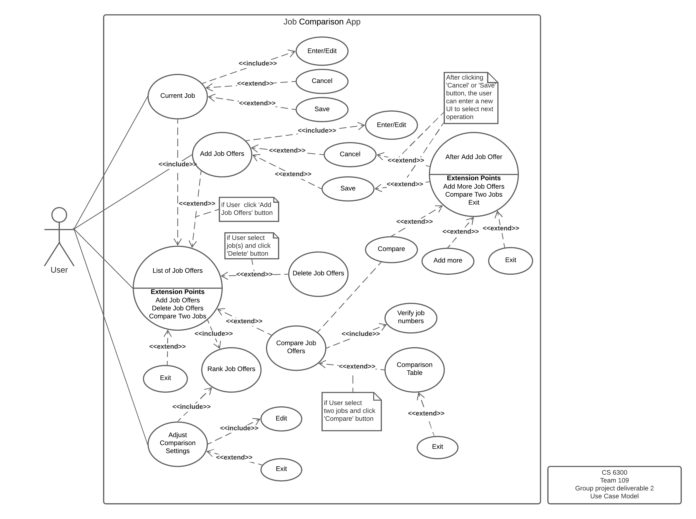

# Use Case Model

**Author**: Team 109

## 1 Use Case Diagram

## 2 Use Case Descriptions

1. Current Job
- *Requirements: User can 'enter/edit current job', 'save current job details and return to the main menu', and 'cancel without saving and return to the main menu'.*
- *Pre-conditions: Click the 'Current Job' button then enter the Current Job GUI.*  
- *Post-conditions The user can either click the 'Save' button or 'Cancel' button to return the main menu.*
- *Scenarios:* 
    1. *Once the user enters the Current Job GUI, the interface will load and show all the information of the user's current job.* 
    1. *If there is no information, the user is able to enter any missed information.* 
    1. *If the user wants to modify some current job information, the user can directly edit it.* 
    1. *If the user wants to save the current information, the user can click the 'Save' button, and then return to the main menu*
    1. *If the user wants to cancel current editing, the user can click the 'Cancel' button to return the main menu without saving.* 
   
2. Add Job Offers
- *Requirements: User can 'enter/edit job offers', 'save job offer details', 'cancel', 'add more job offers' and 'compare current job offer with current job (if present)'*
- *Pre-conditions: Click the 'Add Job Offers' button then enter the Job Offer GUI.*
- *Post-conditions: The user can either click the 'Save' button or 'Cancel' button to enter next interface for next operation.*
- *Scenarios:*
     1. *Once the user enters the Add Job Offers GUI, the interface will show an empty list to allow user to enter all of the details of the job offer.* 
     1. *If the user wants to save the offer information, the user can click the 'Save' button to enter next interface for next operation..*
     1. *If the user did not provide all of the required infomation (for ranking), the user can't save the job offer.*
     1. *If the user wants to cancel current editting, the user can click the 'Cancel' button to enter next interface for next operation.* 
     1. *Once the user saved or canceled the job offer editing, a new interface will pop up, asking the user what he wants to do next. The use can select to return the main menu, add more offer, and compare current offer with current job* 
     1. *If the user select 'add more' button, the interface will show an empty list to allow user to enter all of the details of the job offer as step 1*
     1. *If the user select 'compare' button, a comparison between current job offer and current job will be shown in a table.*
     1. *The user is able to return to the main menu by clicking the 'Exit' button.* 
     

3. List of Job Offers 
- *Requirements: User can see 'a list of ranked job offers including current job', 'add job offers', 'delete job offer(s)', and 'compare two offers'*
- *Pre-conditions: Click the 'Add Job Offers' button then enter the Job Offer GUI.*
- *Post-conditions: The user must click the 'Exit' button to return the main menu.*
- *Scenarios:*
    1. *Once the user enters the List of Job Offers GUI, the interface will show a list of ranked job offers including current job.* 
    1. *If the user want to add a job offer, the user can click the 'Add Job Offers' button to enter the Add Job Offers GUI.*
    1. *If the user wants to delete some job offers, the user can select the corresponding listed job offers and click the 'Delete' button.* 
    1.  *If the user wants to compare two job offers, the user can select two listed job offers and click the 'Compare' button. A table comparing the two selected jobs will be shown in a new interface. The user can return to the List of Job Offers interface by clicking the 'Exit' button.*
    1. *The user is able to return to the main menu by clicking the 'Exit' button.* 

4. Adjust Comparison Settings
- *Requirements: User can assign integer weights to corresponding factors*
- *Pre-conditions: Click the 'Adjust Comparison Settings' button then enter the Comparison Settings GUI.*
- *Post-conditions: The user must click the 'Exit' button to return the main menu.*
- *Scenarios:*
     1. *If the user did not set any weights, all default weights are one.* 
     1. *If the user enters the Comparison Setting GUI, the user can modify the weights by entering an integer number for the corresponding factors.* 
     1. *The user is able to return to main menu by clicking the 'Exit' button.* 

