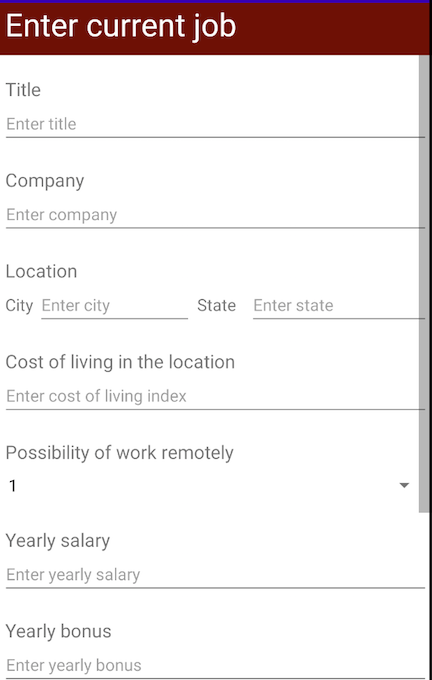
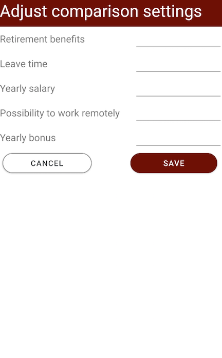
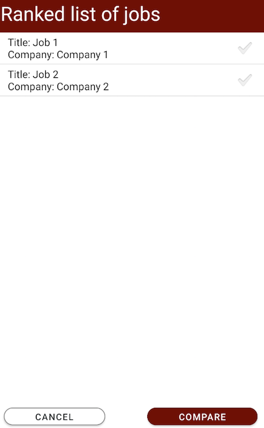
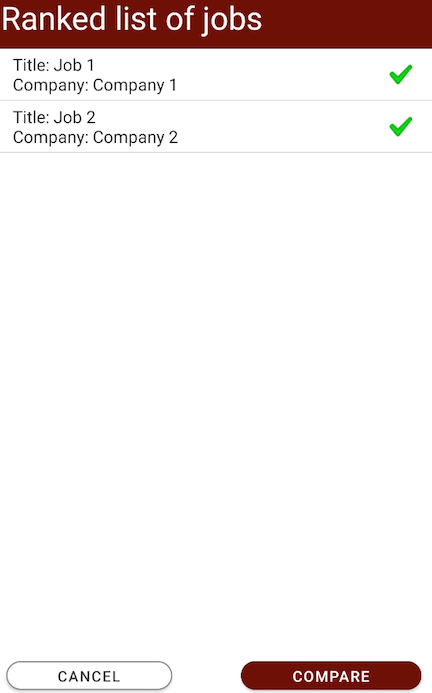
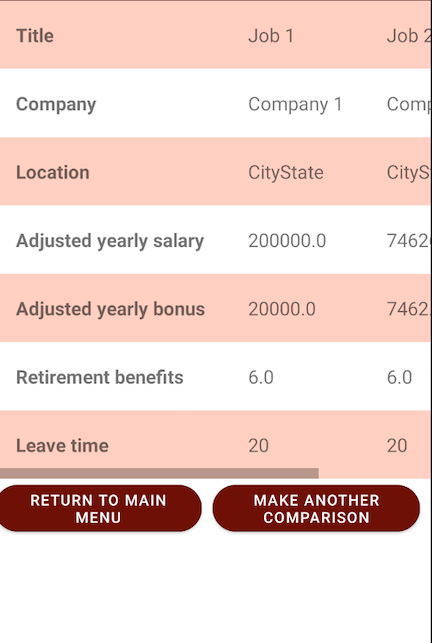

# JobCompare6300 User Manual

**Author**: Team 109

## Introduction

This simple app leverages an Affine Cipher (i.e., E(x) = (αx + β) % 26) to encrypt messages. It will take a string that contains at least one letter (defined as [a-zA-Z]) and encrypt the letter(s).

## Getting Started

### Dependencies
* Pixel 2 API 28

## Main Features

* **Enter / edit a current job** - save current job details
* **Enter job offer(s)** - save all job offers and their details
* **Adjust comparison settings** - adjust preferences of job aspects (e.g., salary, bonus, etc.)
* **Compare jobs** - compare saved jobs

### Enter / Edit a Current Job
Easily store or edit current job details here.

* `Title` - title of the job
* `Company` - company of the job
* `Location: City` - city where the job is located
* `Location: State` - state where the job is located
* `Cost of living in the location` - index of the city. Can be found here: https://www.expatistan.com/cost-of-living/index/north-america
* `Possibility of work remotely` - allowed telework days. Possible inputs are 1 to 5 inclusive
* `Yearly salary` - dollar salary
* `Yearly bonus` - dollar bonus
* `Retirement benefits` - annual retirement benefits as a percentage. Valid inputs are 0 to 100
* `Leave time` - leave time expressed in days. Round to nearest integer

#### Instructions
1. Input valid values for all fields. There is no drafting so unsaved details will be lost.
1. Click the `SAVE` button to store information or `CANCEL` to return to main screen.

*Note: only one current job can be saved. Once saved, User may come back to edit current job.*

### Enter Job Offer
Easily store all job offers here.

* `Title` - title of the job
* `Company` - company of the job
* `Location: City` - city where the job is located
* `Location: State` - state where the job is located
* `Cost of living in the location` - index of the city. Can be found here: https://www.expatistan.com/cost-of-living/index/north-america
* `Possibility of work remotely` - allowed telework days. Possible inputs are 1 to 5 inclusive
* `Yearly salary` - dollar salary
* `Yearly bonus` - dollar bonus
* `Retirement benefits` - annual retirement benefits as a percentage. Valid inputs are 0 to 100
* `Leave time` - leave time expressed in days. Round to nearest integer

#### Instructions
1. Input valid values for all fields. There is no drafting so unsaved details will be lost.
1. Click the `SAVE` button to store information, `CANCEL` to return to main screen, or `COMPARE` to compare to current job (if entered).
1. When clicking `SAVE`, a successful save will display the following screen:

*Note: job offers cannot be edited after saving.*

### Adjust Comparison Settings
Not all aspects of a job offer may be equaled. Adjust settings to weight aspects relative to each other based on personal preferences.

* `Retirement benefits` - weight for consideration of retirement benefits. Must be integer greater than or equaled to 0
* `Leave time` - weight for consideration of leave time. Must be integer greater than or equaled to 0
* `Yearly salary` - weight for consideration of yearly salary. Must be integer greater than or equaled to 0
* `Possibility to work remotely` - weight for consideration of remote work. Must be integer greater than or equaled to 0
* `Yearly bonus` - weight for consideration of yearly bonus. Must be integer greater than or equaled to 0

#### Instructions
1. Input valid integer values for all fields
1. Click the `SAVE` button to store information or `CANCEL` to return to main.

*Note: if weight values are not entered, all weights will default to a weight of 1. User cannot set all weights to 0.*

### Compare Jobs
View all jobs and compare two jobs in detail here.

#### Instructions
1. Review job details that have been entered including current job and all job offers. All jobs will be returned sorted by job score descending. the job with the highest score based on preferences / weights will be returned at top. The calculation for job score is as follows: **AYS + AYB + (RBP * AYS) + (LT * AYS / 260) - ((260 - 52 * RWT) * (AYS / 260) / 8)**
1. Select two jobs to compare. Only two jobs can be selected at max:

1. Click `COMPARE` to see job details of selected jobs. Only two jobs can be compared:

*Note: comparison feature is only available after entering two or more jobs.*

## Acknowledgments

* Hat tip to the lectures and piazza discussions
